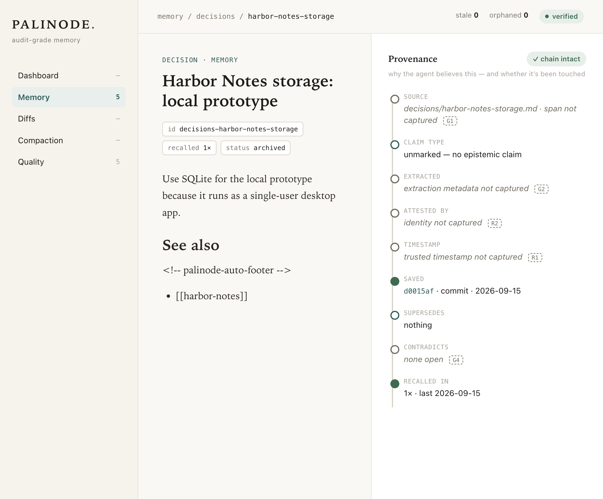

# Local provenance UI

Palinode includes a local, server-rendered inspector for browsing what the
agent remembers and the evidence available for each memory. It runs inside the
existing API process at `/ui`; there is no separate UI service, JavaScript
build, CDN, or account to configure.

The inspector is designed for local audit work. It shows memory health,
browsable files, search results, recent Git changes, consolidation history,
quality queues, and a provenance panel for each memory.

## Open the UI

Start Palinode in the foreground:

```bash
palinode start
```

Keep that terminal open, then visit:

<http://127.0.0.1:6340/ui/>

`palinode start` launches both the API and file watcher. If you already run the
systemd services, Docker Compose stack, or `palinode-api` directly, do not
start a second copy: open the same URL after confirming the API is healthy.

```bash
curl http://127.0.0.1:6340/health
```

The URL follows the configured API port. For example:

```bash
PALINODE_API_PORT=7000 palinode start
```

opens the inspector at `http://127.0.0.1:7000/ui/`.

### Inspect a remote machine safely

The API process that serves the UI must still bind to loopback on the remote
machine. Forward that loopback port over SSH:

```bash
ssh -L 6340:127.0.0.1:6340 user@memory-host
```

Then open `http://127.0.0.1:6340/ui/` in your local browser. This does not make
the UI listen on the remote machine's LAN interface.

## First decision: inspect, correct, and retire

The inspector is a read-only way to audit a memory after an agent or the CLI
has saved it. This small, fictional example uses the `harbor-notes` project.
It deliberately uses [explicit lexical retrieval](lexical-retrieval.md), so
the first-use path needs no embedding, chat, or consolidation service. Use the
[canonical Quickstart](QUICKSTART.md) to select and install the source checkout
and create the disposable store; this section is the inspector view of that
same walkthrough, not a second mandatory setup.

In a disposable local store, set the server mode before starting it. In a
second terminal using the same installed Palinode client, save the initial
decision through the existing CLI:

```bash
# Terminal 1: reuse Quickstart's PALINODE_BIN and PALINODE_DIR; this keeps running.
export PALINODE_RETRIEVAL_MODE=lexical
export PALINODE_API_HOST=127.0.0.1
"$PALINODE_BIN/palinode" start
```

```bash
# Terminal 2: reuse the same PALINODE_BIN, PALINODE_DIR, and retrieval mode.
"$PALINODE_BIN/palinode" save \
  'Use SQLite for the local prototype because it runs as a single-user desktop app.' \
  --type Decision --project harbor-notes --slug harbor-notes-storage \
  --title 'Harbor Notes storage: local prototype'
```

Open <http://127.0.0.1:6340/ui/memory/decisions/harbor-notes-storage>.
The fact page displays the saved text and its provenance rows, including the
source path and latest Git commit. The **Memory** page can browse the saved
file; its search box uses the configured retrieval mode, so searching
`harbor-notes` in this example is keyword/FTS retrieval rather than a semantic
claim. The inspector does not edit a memory or inject historical context into
an agent.

Use the existing read and Git-history commands when you need the complete
source or commit evolution:

```bash
"$PALINODE_BIN/palinode" read decisions/harbor-notes-storage.md --meta
"$PALINODE_BIN/palinode" history decisions/harbor-notes-storage.md --detail full
```

The linked **Saved** commit in the provenance panel opens the inspector's
existing history route, which currently returns to the fact detail. The CLI
history command above is the supported full-diff view.

Before correcting the storage decision, save a UTC neighbor that must remain
unchanged and a separate requirement supporting the hosted-service rationale.
Then save an explicit correction with a supersession link, a typed support link
to that requirement, and a historical quote from the initial decision. Do not
silently alter the original decision:

```bash
"$PALINODE_BIN/palinode" save \
  'Store event timestamps in UTC.' \
  --type Decision --project harbor-notes --slug harbor-notes-timestamps

"$PALINODE_BIN/palinode" save \
  'The shared hosted service requires transactional coordination for concurrent writers.' \
  --type Decision --project harbor-notes --slug harbor-notes-concurrent-write-requirement

"$PALINODE_BIN/palinode" save \
  'Use PostgreSQL for the shared hosted service because concurrent writers need transactional coordination.' \
  --type Decision --project harbor-notes --slug harbor-notes-storage-shared \
  --cite 'decisions/harbor-notes-storage.md::Use SQLite for the local prototype because it runs as a single-user desktop app.' \
  --cite 'decisions/harbor-notes-concurrent-write-requirement.md::The shared hosted service requires transactional coordination for concurrent writers.' \
  --backed-by decisions/harbor-notes-concurrent-write-requirement \
  --metadata-json '{"supersedes":"decisions/harbor-notes-storage.md"}'

"$PALINODE_BIN/palinode" archive decisions/harbor-notes-storage.md \
  --superseded-by decisions/harbor-notes-storage-shared.md \
  --reason 'The shared hosted service needs concurrent-write coordination.'
```



The screenshot is taken **after** the retirement above: it shows the archived
initial SQLite decision and its Saved commit, not a state before the save steps.
`archive` retires the old memory from default recall and records the reason in
its audit history, but it is not permanent erasure: the original and its Git
history remain recoverable. Start a fresh session and search for the PostgreSQL
decision, then inspect its source and the UTC neighbor:

```bash
"$PALINODE_BIN/palinode" prime --project harbor-notes
"$PALINODE_BIN/palinode" search 'PostgreSQL shared hosted service'
"$PALINODE_BIN/palinode" read decisions/harbor-notes-storage-shared.md --meta
"$PALINODE_BIN/palinode" read decisions/harbor-notes-timestamps.md --meta
```

The new decision's metadata records its supersession, the separately saved
concurrent-writers support, and the preserved SQLite history reference; the UTC
neighbor remains a separate unchanged file. The SQLite quote proves that the
saved text matches the quoted passage, not that the old SQLite rationale
supports PostgreSQL or that either claim is true. Likewise, an unresolved
conflict such as north versus south deployment region stays unresolved until
explicit evidence supports a change; neither the inspector nor an archive
command should pick a winner.

### Visibility and lifecycle limits

The no-token demo described here is loopback-only, not a browser login flow.
On a token-enabled API the browser must already send a bearer token
on every UI request; the inspector has no sign-in form. Keep the loopback guard
in place and use the SSH-forwarding pattern above instead of exposing `/ui/`.

The Memory and Search views are discovery views and apply the configured
visibility rules. A known, validated detail path and provenance/history can be
read under the existing API contract, while Diffs and Compaction are privileged
audit views that can expose broader Git history. Scope labels are not
per-person authentication or encryption; see the [privacy and visibility
contract](PRIVACY.md) before sharing a store, backup, or token.

Archiving is lifecycle state, not a promise to remove every historical copy.
It does not erase Git history, backups, clones, or an already-derived index.
Capture, pause, and exclusion controls are separate future work; this guide
does not claim they are available in the inspector.

## Views

| View | Path | What it answers |
|---|---|---|
| Dashboard | `/ui/` | How many browsable memories and indexed chunks exist? Which health counts need attention? What changed recently? |
| Memory | `/ui/memory` | Which memory files can I browse? Which are core, fresh, aging, stale, or a given type? |
| Search | `/ui/memory?q=terms` | Which indexed memories match this query? |
| Fact detail | `/ui/memory/<category>/<slug>` | What does this memory say, what metadata does it carry, and what provenance is available? |
| Diffs | `/ui/diffs` | Which memory files changed in recent Git commits? |
| Compaction | `/ui/compaction` | Which consolidation passes ran, and which archived-fact history files exist? |
| Quality | `/ui/quality` | Which memories are stale, orphaned, missing descriptions, contradictory, missing extraction metadata, or resting on a retired `backed_by` source? |

### Dashboard

The dashboard combines file, index, lint, and Git information:

- **Memories** counts browsable Markdown files on disk.
- **Chunks** counts records in the derived SQLite index.
- **Core**, **stale**, **orphaned**, **no description**, and
  **contradictions** come from the same lint data used by `palinode lint`.
- **Commits / 7d** counts recent commits in the memory repository.
- **Recent memory** comes from the index and is deduplicated by file.

If files exist but the index has no chunks, the page says so explicitly. Start
the watcher or run `palinode reindex`; file-based counts and browsing still
work while search and index-backed recent memory remain unavailable.

### Browse and search

The unfiltered Memory view reads the Markdown files, because files are
Palinode's source of truth. Its filters include:

- `core`
- memory type
- `fresh` (updated within 7 days)
- `aging` (8–90 days)
- `stale` (more than 90 days)

The browsable list omits operational or special-purpose paths: `daily/`,
`archive/`, `inbox/`, `logs/`, `prompts/`, `.obsidian/`, and consolidation
siblings ending in `-history.md`. History files remain available from the
Compaction view.

Search is different from browsing: it needs an index. In explicit lexical mode
it uses FTS and needs no embedding endpoint; in hybrid mode it also needs the
configured embedding endpoint. If hybrid's endpoint is unavailable, the page
keeps working and displays a `search unavailable` notice instead of failing the
whole view. Lexical mode is explicit, not a silent hybrid fallback.

Each search hit shows two labels the browse list does not: `index matches
source` / `⚠ index stale` (whether the indexed chunk still agrees with the file
— a different question from the list's age-based `fresh` / `aging` / `stale`)
and, when there is something to warn about, `⚠ retired: …` or `⚠ contested`
(whether the assertion is still in force). Agreement never implies currency: a
chunk that still holds a superseded fact's struck-through text matches its
source and is labelled retired.

### Fact detail and provenance

Selecting a memory renders its Markdown body and useful frontmatter fields,
including type, ID, confidence, priority, status, and recorded recall count
when present. Raw HTML is disabled during Markdown rendering, and the result
is sanitized before it reaches the page.

The provenance panel distinguishes information Palinode has from information
it does not yet capture. Depending on the file, real rows can include:

- the source file path;
- an explicit epistemic claim type such as `fact`, `inference`,
  `open_question`, or `unverified`;
- the latest Git commit that saved the file;
- a `supersedes` target; and
- recall count and last-recalled date.

Rows marked `G1`, `G2`, `G3`, `G4`, `R1`, or `R2` are explicit provenance
gaps, not successful attestations. For example, extraction identity, source
span, and a trusted timestamp may say “not captured.” An absent epistemic field
is shown as **unmarked**, never silently promoted to **fact**.

The current detail route does not yet run a content-hash mismatch check. The
visual “chain intact” state is therefore not an independent cryptographic
attestation; use the underlying Git history and Palinode's validation tools
when investigating integrity.

### Diffs and compaction

Diffs groups recent commits by day and shows only touched Markdown memory
files. Database, journal, and log files are deliberately removed from this
view. The default window is 14 days; choose another window from 1 to 365 days
with a query parameter, for example `/ui/diffs?days=30`.

Compaction reads commits whose subjects identify a compaction or nightly pass,
plus the `-history.md` audit-trail files on disk. Its default window is 90 days
and accepts the same 1–365 day range, for example
`/ui/compaction?days=180`. Opening this view never starts consolidation.

### Quality queues

Quality presents the current lint findings as linkable queues:

- stale active memories;
- orphaned memories with no entity relationship or inbound reference;
- memories missing a one-line description;
- contradictory active memories;
- memories whose extraction provenance is not yet captured; and
- memories with stale backing — a `backed_by` source that was superseded,
  retracted, archived or merged away. The row names the retired source and how
  it was retired; re-saving the memory clears it.

The sidebar badge counts the actionable stale, orphaned, missing-description,
contradiction, and stale-backing queues. It intentionally excludes the
extraction-metadata queue while that metadata is not captured for ordinary
memories.

## Read-only and access boundaries

Every UI route is a `GET` route. The inspector offers no save, edit, archive,
rollback, reindex, or consolidation action, and browsing it does not modify or
commit memory Markdown.

Search has one narrower operational side effect: because the UI deliberately
reuses Palinode's normal search capability, a successful query updates recall
metadata in the derived SQLite index and records normal retrieval telemetry.
It still does not change the source Markdown or create a Git commit. Merely
opening the dashboard, lists, diffs, compaction, quality, or fact page does not
perform that search accounting.

### Loopback is mandatory

The UI refuses to render when `PALINODE_API_HOST` resolves to a non-loopback
address. A public bind such as `0.0.0.0` receives HTTP 403 for `/ui`, even when
either of these API options is set:

- `PALINODE_API_BIND_INTENT=public`
- `PALINODE_API_ALLOW_UNAUTH=1`

Those options affect API deployment; they do not override the inspector's
separate loopback guard. Keep `PALINODE_API_HOST=127.0.0.1` (the default), use
`localhost`/`::1`, or use the SSH-forwarding pattern above.

If `PALINODE_API_TOKEN` or `PALINODE_API_TOKEN_FILE` is configured, the API's
bearer middleware also protects `/ui` and its static assets. The UI has no
sign-in form. A client must add `Authorization: Bearer <token>` to every UI
request; do not put the token in the URL.

Anyone who can open the UI can read the memory content it displays. The
loopback refusal is therefore a security boundary, not a deployment
suggestion. See [SECURITY.md](../SECURITY.md#api-authentication) for the API's
separate authentication rules.

## Data sources and graceful degradation

| Source | Used for | If unavailable |
|---|---|---|
| Markdown files | memory count, browse list, fact body and frontmatter | There is no memory content to display. |
| SQLite index | chunk count, search, recent memory, recall statistics | File browsing still works; search/recent/index metrics are empty or degraded. |
| Git repository | recent changes, compaction commits, saved lineage | Those sections show no history; memory content still renders. |
| Lint pass | health cards and quality queues | The affected request cannot build its health context. |
| Embedding backend | semantic/hybrid search queries | Only hybrid search shows a soft unavailable notice; lexical FTS search and other views remain usable. |

## Installation footprint

The inspector ships as part of the standard Palinode installation, not an
optional extra. Three required runtime dependencies exist specifically for
this surface:

- `jinja2` renders the server-side templates;
- `markdown-it-py` renders memory Markdown with raw HTML disabled; and
- `nh3` sanitizes the resulting HTML as a defense-in-depth boundary.

`nh3` is also the heaviest single import in the current CLI startup profile.
There is no supported “headless without UI dependencies” installation profile
today.

## Troubleshooting

| Symptom | Check |
|---|---|
| Browser cannot connect | Confirm `palinode-api` is running and `curl http://127.0.0.1:6340/health` succeeds. |
| HTTP 403 with “loopback-only” | The API is configured with a non-loopback host. Restart it with `PALINODE_API_HOST=127.0.0.1`; public-intent and unauthenticated opt-out flags do not override this guard. |
| HTTP 401 | Bearer authentication is enabled. The UI has no login page; ensure the browser client supplies the header on HTML and static-asset requests. |
| Memories exist but chunks/search/recent are empty | Start the watcher or run `palinode reindex`, then refresh. |
| Search alone says unavailable | In hybrid mode, check the embedding service with `palinode doctor`; in lexical mode, check index readiness. File and Git views do not require embeddings. |
| Diffs or saved lineage are empty | Confirm the memory directory is a Git repository with commits in the selected time window. |
| Compaction is empty | No matching compaction/nightly commit exists in the selected window; viewing the page does not run one. |

For service and recovery procedures, see the
[Operations guide](OPERATIONS.md). For the relationship between files, the
index, Git, and recall, see [How memory works](HOW-MEMORY-WORKS.md).
